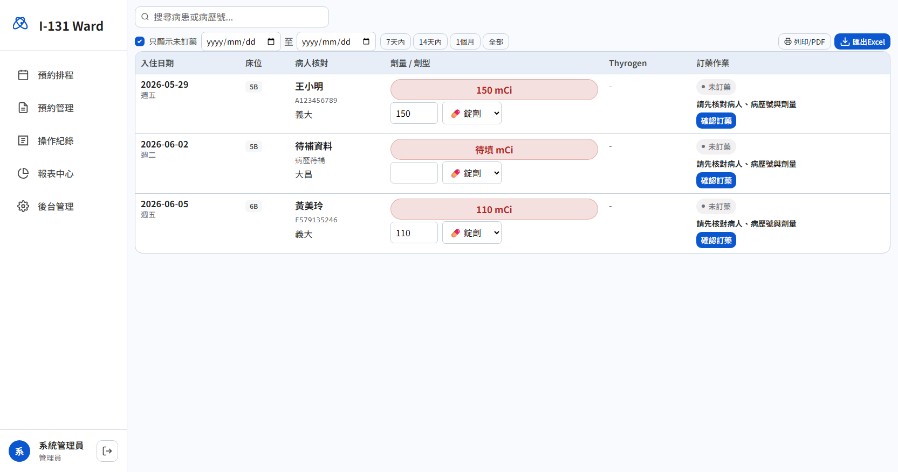

# I-131 Ward Scheduler Demo

這個 repo 是 **碘-131 隔離病房排程系統的展示原型**。目前版本重點是把排程邏輯、畫面密度、管理流程與交接文件整理好，方便院內工程師接手評估與改版。

**Demo 網址**：https://purekboy-ui.github.io/I131-Ward-Scheduler/

## Demo 定位

- **用途**：展示排程流程、畫面配置、欄位需求與權限概念。
- **資料**：全部都是前端 mock data。
- **狀態**：可展示、可討論、可交接；**不是正式上線版**。
- **限制**：目前沒有正式後端、沒有正式登入、不能存放真實病患資料。

## 畫面總覽

| 畫面 | 作用 | 這版設計重點 |
| --- | --- | --- |
| 登入頁 | 進入 demo | 只保留最少資訊，方便院內工程師快速進站測試 |
| 預約排程 | 住院大劑量 / 門診小劑量月曆 | 預設一屏看完整月，優先讓人看到床位、病人、劑量、空床與未開床 |
| 預約管理 | 集中核對與收單 | 拿掉多餘裝飾，讓日期、病人、劑量、主治醫師更好掃描 |
| 報表中心 | 條件查詢與列印 | 讓工程師看清楚未來匯出需求與欄位組合 |
| 後台管理 | 醫師、床位開關、帳號 | 把日常維護入口集中，減少分散操作 |
| 操作紀錄 | 追蹤異動 | 保留誰改了什麼的概念，方便之後接正式稽核 |
| 訂藥管理 | 對照住院預約與訂藥狀態 | 劑量、劑型、Thyrogen、是否已訂藥集中顯示 |
| 小劑量預約 | 門診清單版操作 | 與住院分流，避免干擾床位月曆判讀 |

## 介面說明與設計原因

### 1. 登入頁

- **作用**：快速進入展示系統。
- **為什麼這樣設計**：
  - 保留最少文字，讓第一次開站的人不會被複雜資訊干擾。
  - 直接在畫面上提供 demo 帳號，方便院內工程師立即測試。

### 2. 預約排程：住院大劑量月曆


- **作用**：一眼看完整月 5B / 6B 的住院排程。
- **為什麼這樣設計**：
  - 目標是 **不用捲動就能看完整月**。
  - 灰底讓未開床日期更安靜，不搶有床位日期的注意力。
  - 每格直接顯示床位、病人、劑量與狀態，不讓人來回點擊查資料。
  - 空床會直接露出可新增入口，方便排床。

### 3. 預約排程：門診小劑量月曆


- **作用**：看整月門診小劑量給藥分布。
- **為什麼這樣設計**：
  - 與住院月曆切開，避免床位資訊與門診資訊互相干擾。
  - 同日盡量直接顯示至少 3 筆資料，減少額外開窗。
  - 一樣保留快速新增入口，維持操作直覺。

### 4. 預約管理


- **作用**：集中核對病人資料、劑量、主治醫師，並由管理者收單。
- **為什麼這樣設計**：
  - 刻意弱化花俏 tag，把注意力留給日期、病人、劑量、主治醫師。
  - 收單、編輯、刪除都放在資料列旁邊，減少視線移動。
  - 這頁是流程核心，負責把「先卡位」轉成「正式確認」。

### 5. 訂藥管理



- **作用**：核對住院排程對應的訂藥需求。
- **為什麼這樣設計**：
  - 劑量、病人、劑型、Thyrogen、訂藥狀態靠近排，避免對錯人。
  - 保留列印 / 匯出展示，讓院內工程師知道未來有紙本或報表需求。

### 6. 報表中心


- **作用**：依日期、院區、主治醫師、劑量條件做查詢與列印。
- **為什麼這樣設計**：
  - 先把未來最常見的查詢條件直接放在頁面上。
  - 下方預覽表格就是給工程師看的欄位需求草稿。

### 7. 後台管理


- **作用**：集中維護主治醫師、床位開關、帳號。
- **為什麼這樣設計**：
  - 避免後台出現大片無意義留白。
  - 三種管理工作集中在同一頁，減少切頁與找功能的成本。
  - 床位開關以日期直接操作，符合實際排程習慣。

### 8. 操作紀錄


- **作用**：查看誰做了什麼異動。
- **為什麼這樣設計**：
  - 這是未來正式稽核需求的展示版入口。
  - 先把查詢方式與記錄概念做出來，方便後端正式化時接資料流。

### 9. 小劑量預約清單


- **作用**：用表格逐筆管理門診小劑量預約。
- **為什麼這樣設計**：
  - 與月曆頁分工：月曆看分布，清單看逐筆資料。
  - 讓編輯、刪除與人工核對更直接。

完整截圖版仍保留在 [`docs/SCREEN_REFERENCE.md`](docs/SCREEN_REFERENCE.md)。

## 目前排程邏輯

1. **住院 / 門診新建預約一律先進待確認**。
2. **管理者核對病歷號、病人姓名、劑量、主治醫師後，才可收單改為已確認**。
3. **已確認後，一般使用者不能再編輯、刪除或移動該筆預約**。
4. **床位是否可排是日期 x 床位開關，不是只看星期**。
5. **門診小劑量預設可排任何未來日期**。
6. **主治醫師清單會同步反映在後台、預約表單、報表篩選**。

完整 SOP 請看 [`docs/SYSTEM_WORKFLOW.md`](docs/SYSTEM_WORKFLOW.md)。

## Demo 帳號

| 帳號 | 密碼 | 角色 | 用途 |
| --- | --- | --- | --- |
| `admin` | `admin` | 管理員 | 檢視完整功能、收單、後台維護 |
| `user` | `user` | 一般使用者 | 驗證一般排程與鎖定規則 |

> 程式內還保留 `super_editor`、`viewer` 角色結構，方便院內工程師後續擴充，但本 repo 預設只提供上面兩組 demo 帳號。

## 專案結構

目前瀏覽器實際載入的是下列三個檔案：

- `index.html`
- `styles.css`
- `app.js`

其他拆分的 JS 檔仍留在 repo 內當參考，但 **不是目前 demo live runtime**。

## 本地開啟方式

```bash
git clone https://github.com/purekboy-ui/I131-Ward-Scheduler.git
cd I131-Ward-Scheduler
npm install
npm run dev
```

如果只想快速打開靜態頁，也可以直接用任何靜態伺服器，例如：

```bash
npx http-server . -p 8080 -c-1
```

## 交接文件

- [`docs/ENGINEER_HANDOFF.md`](docs/ENGINEER_HANDOFF.md)：給院內工程師的技術交接總覽
- [`docs/SYSTEM_WORKFLOW.md`](docs/SYSTEM_WORKFLOW.md)：目前排程規則、權限與 SOP
- [`docs/SCREEN_REFERENCE.md`](docs/SCREEN_REFERENCE.md)：每個畫面用途、設計原因與截圖
- [`PROTOTYPE_HANDOFF_GUIDE.md`](PROTOTYPE_HANDOFF_GUIDE.md)：給非工程背景使用者看的白話版交接說明

## 這版刻意沒有放進 repo 的內容

- 正式後端實作
- 雲端資料庫連線設定
- 真實病患資料
- 正式帳號驗證
- 院內部署腳本

這樣做是為了把 repo 保持在 **安全、可展示、可交接** 的原型狀態。

## 院內正式版還需要補的事

1. 正式登入與帳號管理
2. 後端 API / 資料庫
3. 權限與稽核寫入後端
4. 真實備份、復原與日誌策略
5. 資安與法規審查
6. 去識別資料策略與正式上線流程

## GitHub Pages

這個 repo 可直接當靜態站展示，已補上 `.nojekyll` 以避免 Pages 對靜態資產做額外處理。
