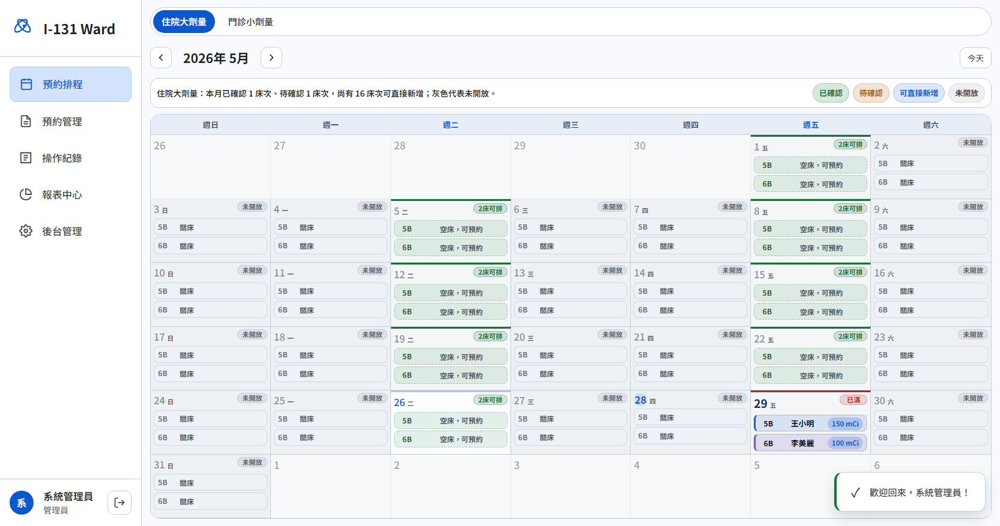
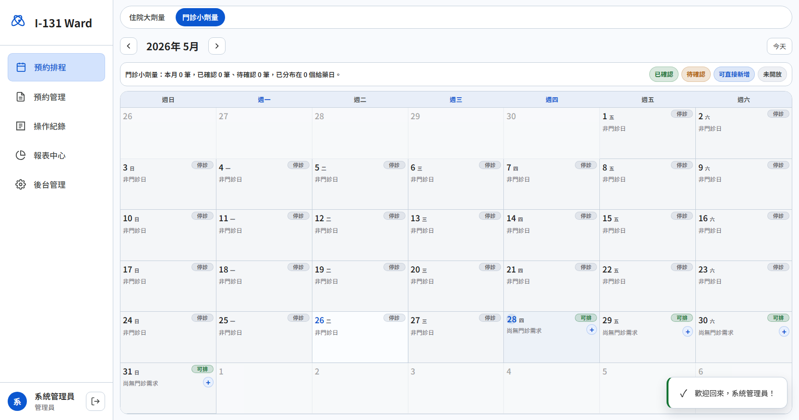
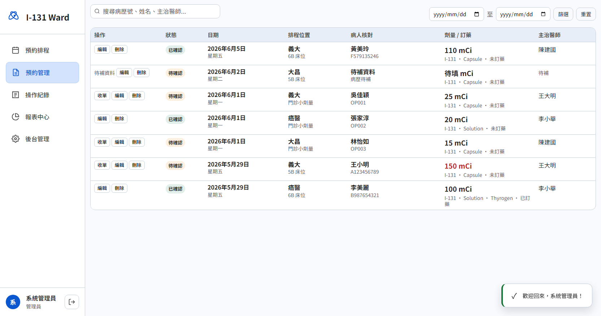
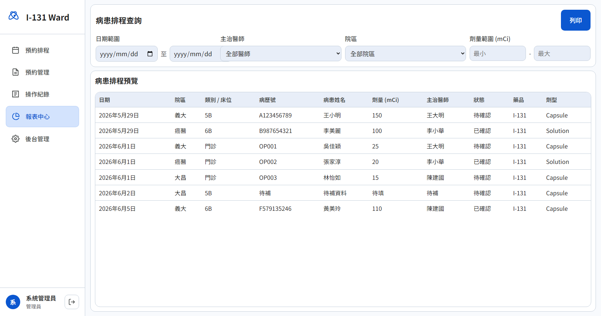
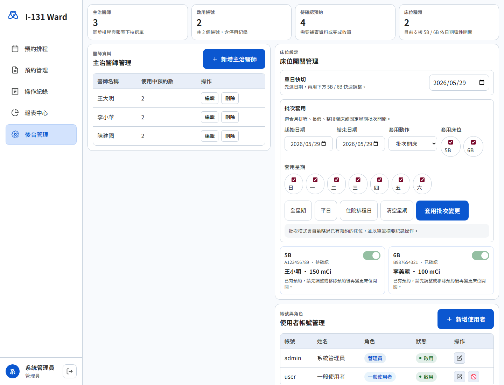
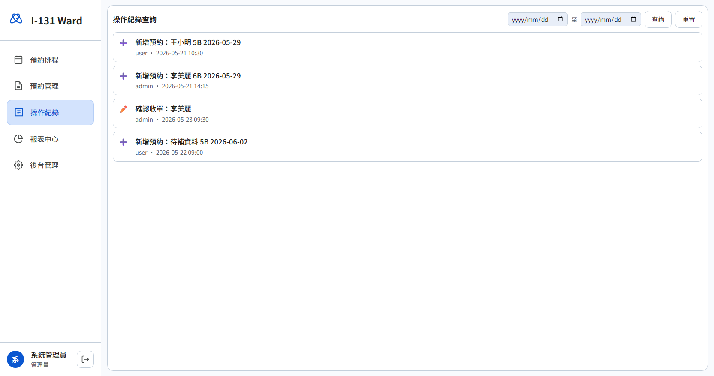
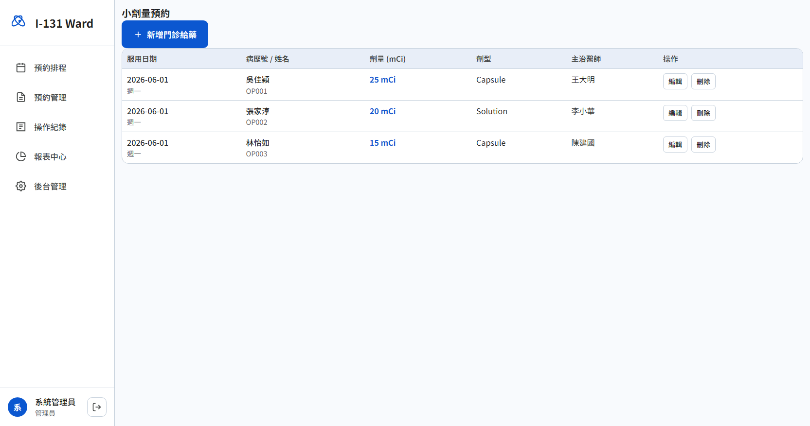

# Screen Reference

本文件提供院內工程師快速理解每個畫面的用途、設計原因與目前截圖。

## 1. 登入頁

- **用途**：快速進入 demo
- **設計原因**：保留最少資訊與 demo 帳號提示，降低展示門檻

## 2. 預約排程（住院大劑量）

- **用途**：看整月 5B / 6B 住院排程
- **設計原因**：
  - 灰底降低刺眼感
  - 一格內直接看床位、病人、劑量
  - 可直接看出空床與未開床
  - 優先做到不捲動即可看完整月

## 3. 預約排程（門診小劑量）

- **用途**：看整月門診小劑量給藥分布
- **設計原因**：
  - 與住院切換分流，避免床位資訊混雜
  - 單日至少可見 3 筆資訊
  - 保留快速新增入口

## 4. 預約管理

- **用途**：集中核對預約資料與收單
- **設計原因**：
  - 弱化彩色裝飾
  - 讓病人、病歷號、劑量、主治醫師更突出
  - 操作按鈕靠近資料列，減少來回掃視

## 5. 報表中心

- **用途**：依日期、院區、主治醫師、劑量條件查詢
- **設計原因**：
  - 先展示查詢欄位與預覽表格
  - 讓工程師明白未來匯出欄位需求

## 6. 後台管理

- **用途**：集中做醫師維護、床位開關、帳號管理，並支援單日切換與日期區間批次套用
- **設計原因**：
  - 收掉不必要留白
  - 將三種管理工作放在同一頁
  - 單日微調給臨時狀況，批次工具給長段排程與固定星期設定

## 7. 操作紀錄

- **用途**：查詢系統異動紀錄
- **設計原因**：
  - 讓院內工程師知道未來需要正式稽核資料流
  - 目前先以展示異動概念為主

## 8. 小劑量預約清單

- **用途**：用表格方式管理門診小劑量預約
- **設計原因**：
  - 與月曆頁分工
  - 方便逐筆核對、編輯、刪除
  - 降低對住院月曆的干擾
